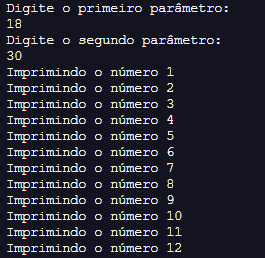
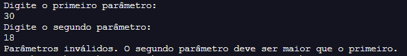

# DESAFIO DE PROJETO - CONTROLE DE FLUXO

Este projeto foi elaborado com intuíto executar o desafio de projeto proposto pelo  professor [Gleyson Sampaio](https://github.com/glysns), onde foi possível aplicar os conhecimentos de Java adiquiridos até o momento no  bootcamp **Santander 2024 - Backend com Java**, em parceria com a [DIO](https://web.dio.me/).

## Controle de Fluxo - Desafio de Projeto

1. Foi criado o projeto `controle-fluxo` que recebe dados via terminal;
2. Dentro do projeto, foi criado a classe `contador.java` com o código do programa.
3. Dentro do projeto, foi criado a classe `ParametrosInvalidosException` representando a exceção de negócio no sistema.

###### Regras de declaração de variáveis

| Atributo  | Tipo     | Exemplo   
| --------- | ---------| ------- 
| Parâmetro Um | Inteiro | 50 
| Parâmetro Dois | Inteiro | 18 

4. O programa irá analizar se o `Parâmetro Um` é menor do que o `Parâmetro Dois` e poderá se comportar das seguintes formas:

    - Em caso positivo: tendo como exemplo o PARÂMETRO UM = 18 e PARÂMETRO DOIS = 30, será executada uma interação (for) com 12 ocorrências para imprimir os números, exemplo: "Imprimindo o número 1", "Imprimindo o número 2" e assim por diante. Exemplo:

        

    - Em caso negativo: se o primeiro parâmetro for MAIOR que o segundo parâmetro, será lançado uma exceção customizada chamada de ParametrosInvalidosException com a mensagem: "Parâmetros inválidos. O segundo parâmetro deve ser maior que o primeiro.". Exemplo:

         